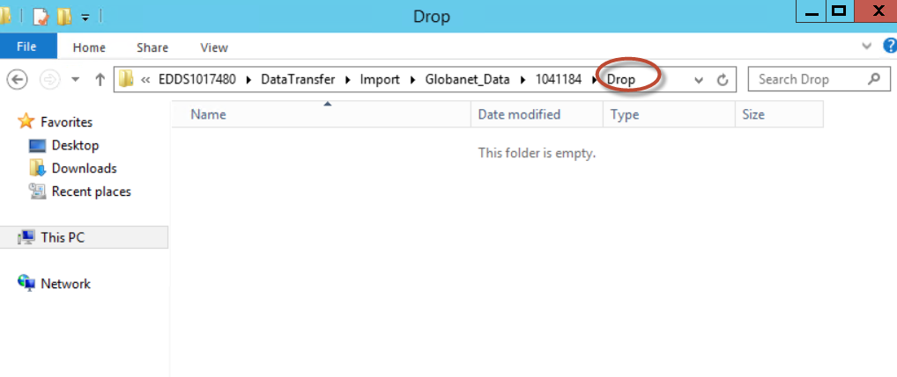
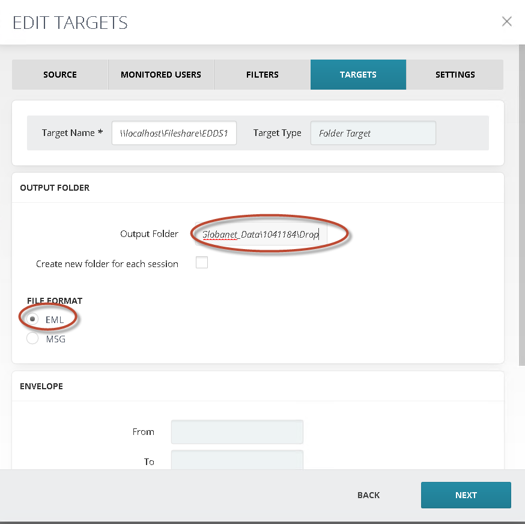
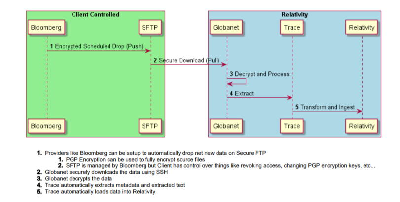
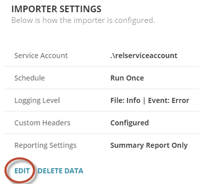

# Relativity Trace Data Source User Guide

**For every Trace Data Source, except for [Microsoft Exchange Data Source](https://relativitydev.github.io/relativity-trace-documentation/user_documentation#microsoft-exchange-data-source), it is required to set up and deploy additional software. This software is called Globanet Merge1. You will also need to install additional hardware.**

  * [Installation](#installation)
    + [Pre-requisites](#pre-requisites)
    + [Installation Steps](#installation-steps)
    + [Data Flow Overview](#data-flow-overview)
  * [Setting up Data Sources](#setting-up-globanet-datas-sources)
    + [Generic steps that apply to all data sources](#generic-steps-that-apply-to-all-data-sources)
  * [Appendix A: Bloomberg, ICE Chat, Thomson Reuters, Symphony](#appendix-a--bloomberg--ice-chat--thomson-reuters--symphony)
  * [Appendix B: Importer Schedule Helper](#appendix-b--importer-schedule-helper)
  * [Appendix C: High Availability Setup for Globanet's Merge1](#appendix-c-high-availability-setup-for-globanets-merge1)

## Installation of Globanet

### Pre-requisites

**System Requirements**

1.  Hardware

    1.  2.4 GHz or faster 64-bit dual-core processor

    2.  16 GB RAM

    3.  300 GB hard-disk space

2. Software

   1. Windows 8 or later; Windows Server 2012 or later

   2. Internet Information Services 7.0 or higher

      1. Make sure the following **components** are installed
         1. **Web Server**
            1. Common HTTP Features
               1. Default Document
               2. Static Content
            2. Security
               1. Basic Authentication
               2. Request Filtering
               3. Windows Authentication
            3. Application Development
               1. All .NET Extensibility Components
               2. All ASP.NET Components
               3. SAPI Extensions
               4. ISAPI Filters
         2. **Web Management Tools**
            1. IIS Management Console
            2. IIS 6 Management Compatibility
               1. IIS Metabase and IIS 6 configuration compatibility
            3. IIS Management Scripts and Tools
            4. IIS Management Service

   3. .NET Framework 3.5 & 4.7.2

   4. Microsoft Visual C++ 2017 (x64) Redistributable

   5. SQL Server 2012 or later

      1. >  **NOTE:** We recommend to take daily backups and keep them for 1 week

      2. >  **NOTE:** We recommend to shrink database daily in order not to run out of disk space

3. Network Requirements

   1.  Server with Globanet needs to have access to Relativity's Fileshare
       1.  If Globanet does not have direct access to Relativity's Fileshare, site-to-site VPN OR SFTP sync can be setup. See Data Flow Overview below for more details
       2.  Server with Globanet only needs access to specific folders on Relativity Fileshare. Details are documents in Data Flow Overview section below.

### Installation Steps for Globanet

Refer to the [Merge 1 User Guide](https://github.com/relativitydev/relativity-trace-documentation/docs/media/trace_connectors_user_guide/Merge1-6.20.0131.257.pdf) for instructions on how to install Globanet. Contact support@relativity.com if you need assitance with installing Globanet.

### Globanet Data Flow Overview 

1. Globanet needs access to the following file `{FILESHARE_WORKSPACE_ROOT}\DataTransfer\Import\Globanet_Data\{DATA_SOURCE_ARTIFACT_ID}\Config\monitored_individuals.csv`
2. Globanet pulls data from a data origin
3. Globanet processes the data and generates the output
4. Globanet pushes the data to Relativity Fileshare's `{FILESHARE_WORKSPACE_ROOT}\DataTransfer\Import\Globanet_Data\{DATA_SOURCE_ARTIFACT_ID}\Drop` folder
5. Globanet pushes any logs to Relativity Fileshare's `{FILESHARE_WORKSPACE_ROOT}\DataTransfer\Import\Globanet_Data\{DATA_SOURCE_ARTIFACT_ID}\Logs` folder

## Setting up Data Sources

### Steps generic to setting up all Data Sources

1.  You must first create an Integration Point Profile if you have not already done so. The Integration Point Profile is used to map fields in the Globanet Data Source load file to the workspace fields in Relativity Trace. Refer to this document [Setting up an Integration Point Profile for Trace Data Sources](https://github.com/relativitydev/relativity-trace-documentation/docs/media/trace_connectors_user_guide/IntegrationPointProfile.pdf).

2.  Create a new Data Source in Relativity Trace for the data source type (for example, ICE Chats) that you want to start pulling data from. Go to the Data Source tab, then click on "New Data Source" in upper left hand corner. Please see [Data Source documentation](https://relativitydev.github.io/relativity-trace-documentation/user_documentation#data-sources) for more information about each Data Source field.

> **NOTE:** When setting up the Data Source, if you do not see the Data Source Type that you need to associate with this Data Source, please contact trace@relativity.com. For example, if you are attempting to configure a Data Source for ICE Chats, and you do not see a Data Source Type = ICE Chats, contact trace@relativity.com. A Trace Specialist will need to set up the Data Source Type with you.

3.  Create Monitored Individuals in Relativity Trace. Go to the Monitored Individuals tab, then click on "New Monitored Individual" to create a new record. You can also bulk upload Monitored Individuals using a CSV load file and the Relativity Desktop Client.

4.  Link the desired Monitored Individuals to the Data Source. To do so, go to the Data Source in view mode. Scroll down to link Monitored Individuals. You are now ready to begin pulling data from this Data Source for the linked Monitored Individuals.

5.  Enable the Data Source. To do so, go to the Data Source in view mode. Click on the blue icon "Enable Data Source" in the console on the right hand side.

### Steps specific to setting up Globanet Sources

1.  By enabling the Data Source, Trace will now automatically generate a CSV file containing the linked Monitored Individuals. Globanet will read from this CSV file to determine who to pull data from for this Data Source.
    
2.  Before proceeding to the next step, **WAIT** until `monitored_individuals.csv` is generated in the following Relativty folder: `{FILESHARE_WORKSPACE_ROOT}\DataTransfer\Import\Globanet_Data\{DATA_SOURCE_ARTIFACT_ID}\Config`
        
        
        
            
    
3. Create a `Drop` folder for where Globanet will be delivering data.

   A.  `{FILESHARE_WORKSPACE_ROOT}\DataTransfer\Import\Globanet_Data\{DATA_SOURCE_ARTIFACT_ID}\Drop`

       

4.  Create `Logs` folder for where Globanet will be delivering logs: `{FILESHARE_WORKSPACE_ROOT}\DataTransfer\Import\Globanet_Data\{DATA_SOURCE_ARTIFACT_ID}\Logs`

5. Edit Data Source and update Source Folder Path field to the relative location of the `Drop` folder:
   `DataTransfer\\Import\\Globanet_Data\\{DATA_SOURCE_ARTIFACT_ID}\\Drop`

   

6. Configure a corresponding “Importer” in Globanet

   1.  Configure monitored individuals to point to
       `{FILESHARE_WORKSPACE_ROOT}\DataTransfer\Import\Globanet_Data\{DATA_SOURCE_ARTIFACT_ID}\Config\monitored_individuals.csv`

       

   2.  If `Monitored User` option is NOT available, configure `Filter` and use `Dynamic` -\> `CSV` option to point it to `{FILESHARE_WORKSPACE_ROOT}\DataTransfer\Import\Globanet_Data\{DATA_SOURCE_ARTIFACT_ID}\Config\monitored_individuals.csv`
       
       
       1. Go to Edit filters
       2. Add new Mail filter
       3. From Filter type select Dynamic option
       4. Select CSV option and type path to CSV file. Please be sure that CSV has no headers and contains only two columns: SMTP address in the first column and the username in the second (example@exampe.com, username).
       5. Go to importer settings
       6. Under the filtering section check Enable Filtering checkbox
       7. Check Process all filters checkbox
       8. Select Match any option
       9. From the first Target dropdown menu select your default target
       10. From Filter dropdown menu select created Mail filter
       11. From the second Target dropdown menu select the target where your monitored users' messages will be imported
       12. Hit the + button and save settings

   3.  Configure Target to point to `{FILESHARE_WORKSPACE_ROOT}\DataTransfer\Import\Globanet_Data\{DATA_SOURCE_ARTIFACT_ID}\Drop`
       
   
   
       
   
       
   4.  Configure `LOG ON ACCOUNT` section
       1.  Best practice is to specify computer administrator's username and password
           
   5.  Configure `REPORTING` section
       1.  Report Level = Generate Summary Report Only
       2.  MISC = Leave Checkbox checked for `Delete reported and ...`
       3.  MUST specify `EMAIL REPORT SETTINGS` and send test email
           
   6.  Configure `LOGGING` section
       1.  File log folder = `{FILESHARE_WORKSPACE_ROOT}\DataTransfer\Import\Globanet_Data\{DATA_SOURCE_ARTIFACT_ID}\Logs`
       2.  File Log Priority = `Error`
       3.  Event Log Priority = `Error`
   7.  Configure `ALERTING` section
       1.  MUST configure Email Alert Settings
       2.  Send Test Email
           
   8.  For data source-specific instructions, Refer to `Merge1 6.0 User Guide.pdf` guide. Reach out to support@relativity.com if you don't have access to this guide.
   9.  Configure `Importer Schedule` to run at a desirable frequency (daily is the most common frequency)
   
   
   

## Appendix A: Bloomberg, ICE Chat, Thomson Reuters, Symphony

All of these Data Sources work similar via scheduled drops of data to an FTP.
Globanet picks it up from SFTP and delivers it to Trace.

See sample data flow below and refer to *Merge1 6.0 User Guide.pdf* for more
details

## Appendix B: Importer Schedule Helper

In order to ensure that data source runs **every X minutes** run the following steps OR manually select appropriate time slots:

1.  Open chrome and navigate to Configuration

    

2.  Edit Importer Settings

    

    

    

    1. Script needed:  `$("div.schedule_table").find("td").click()`
    2. 
    3. At this point Importer will be set to run every x minutes
    
## Appendix C: High Availability Setup for Globanet's Merge1

It is possible to setup Merge1 in HA mode. Recommended approach is to setup secondary Merge1 server that runs the same version of the Merge1 and installed in the same path as the production. You also need to have the same folder structure for all connectors (Import, quarantine, log folders). 

Once that is done, the secondary Merge1 should be connected to the same Merge1 DB as the primary Merge1 server. If for any reason the production server goes down, you just need to run the services on the second Merge1. Please note that no service should be started on the secondary Merge1 if the production is running. 
For the DB, you can take backups on a daily basis or apply any other standard SQL Server  HA scenarios that you wish.
