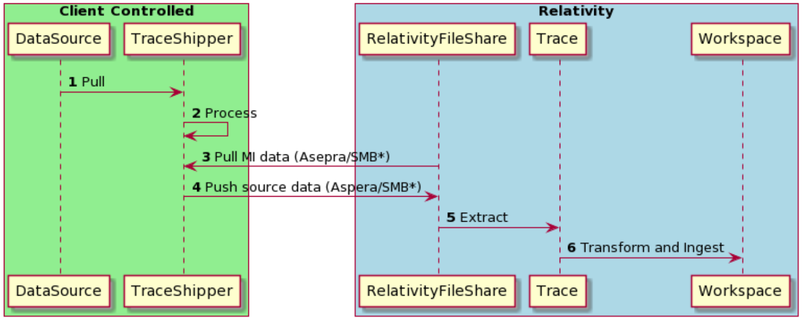
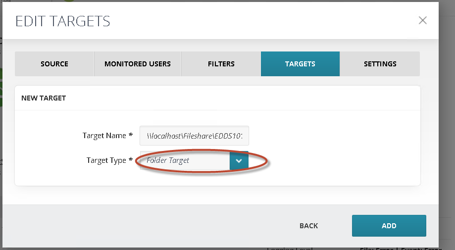
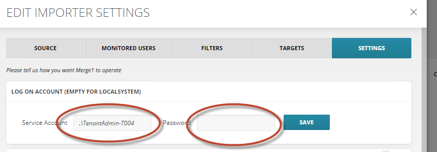
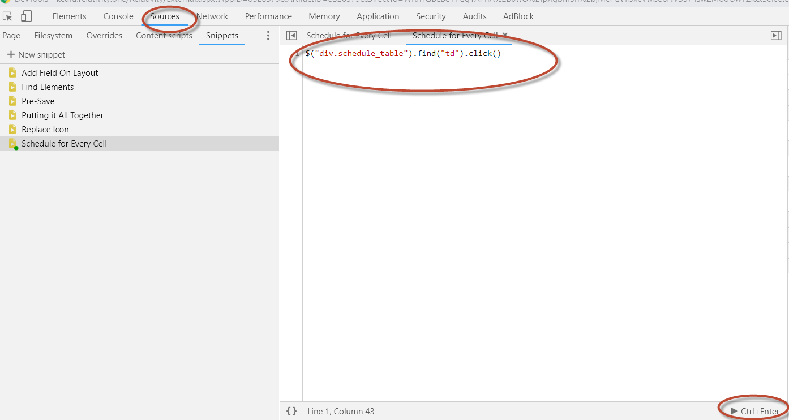

# Relativity Trace Data Source User Guide

For every Trace Data Source, except for [Microsoft Exchange Data Source](https://relativitydev.github.io/relativity-trace-documentation/user_documentation#microsoft-exchange-data-source), it is required to set up and deploy additional software.  In order to ship the data from on-premise network to Relativity you must deploy: Trace Data Shipper and additional data source provider (Globanet Merge1).  You will also need to install additional hardware.

- [Trace Shipper Data Flow Overview](#trace-shipper-data-flow-overview)
- [Installation of Trace Shipper](#installation-of-trace-shipper)
  * [Pre-requisites](#pre-requisites)
  * [Getting Started with Installation](#getting-started-with-installation)
  * [Trace Shipper Service Configuration](#trace-shipper-service-configuration)
  * [Setting Up Data Sources in Relativity](#setting-up-data-sources-in-relativity)
  * [Installation Steps for Globanet](#installation-steps-for-globanet)
  * [Set Up Globanet](#set-up-globanet)
    + [Configuring Globanet Importers](#configuring-globanet-importers)
- [Appendix A: Bloomberg, ICE Chat, Thomson Reuters, Symphony](#appendix-a-bloomberg--ice-chat-thomson-reuters--symphony)
- [Appendix B: Globanet Importer Schedule Helper](#appendix-b-globanet-importer-schedule-helper)
- [Appendix C: High Availability Setup for Globanet's Merge1](#appendix-c-high-availability-setup-for-globanet-s-merge1)

## Trace Shipper Data Flow Overview 

*ref: [PlantUML Code](diagrams/trace_shipper_data_flow.txt)*

> **NOTE:** Data Pull (1) and Process (2) are performed via Globanet Merge1 software | Audio data is provided by external data provider

> **NOTE:** SMB protocol is available only for on-premise deployments with direct access to RelativityFileshare

## Installation of Trace Shipper

### Pre-requisites

**System Requirements**

- Hardware
  -  2.4 GHz or faster 64-bit dual-core processor
  -  16 GB RAM
  -  300 GB hard-disk space
- Software
   - Windows 8 or later; Windows Server 2012 or later
   - Internet Information Services 7.0 or higher
      - Make sure the following **components** are installed
         - **Web Server**
            - Common HTTP Features
               - Default Document
               - Static Content
            - Security
               - Basic Authentication
               - Request Filtering
               - Windows Authentication
            - Application Development
               - All .NET Extensibility Components
               - All ASP.NET Components
               - SAPI Extensions
               - ISAPI Filters
         - **Web Management Tools**
            - IIS Management Console
            - IIS 6 Management Compatibility
               - IIS Metabase and IIS 6 configuration compatibility
            - IIS Management Scripts and Tools
            - IIS Management Service
   - .NET Framework 3.5 & 4.7.2
   - Microsoft Visual C++ 2017 (x64) Redistributable
   - SQL Server 2012 or later
       >  **NOTE:** We recommend to take daily backups and keep them for 1 week
       >  **NOTE:** We recommend to shrink database daily in order not to run out of disk space

### Getting Started with Installation

To set up Trace Shipper, you will need:

1. A Trace Enabled Relativity Workspace along with connection information and approved user credentials
2. A list of connectors you will be setting up

Each connector you set up will require a local directory to ship,  a Relativity Trace Data Source, and a remote Directory to ship to. All three of these must be unique to each connector.

Perform the following steps in order to get started:

1. First, **create** the local directories you will be shipping. The actual directories are up to you, but take note of them for configuration of the Trace Shipper Service (and potentially Globanet), later. 

   1. > **NOTE:** local directory for our purposes means a directory accessible to the Trace Shipper service via normal Windows path calls

   2. > **EXAMPLE:**  Say you are using Globanet to ship both Exchange emails and ICE chat, on the local server, we could create the following directories:
      >
      > * `C:\Globanet\Exchange`
      > * `C:\Globanet\ICE`

2. Next, choose relative paths for the Relativity side of shipper. For convenience, we could make these similar to the local directories we defined above.

   1. > **For example:** Continuing our earlier Exchange and ICE chat example, we might decide our remote relative paths are:
      >
      > * Globanet\Exchange
      > * Globanet\ICE

### Trace Shipper Service Configuration

Trace Shipper Service needs to be installed and configured to send data to your Relativity Trace workspace.  Refer to the [Trace Shipper Guide](trace_shipper_service.md) for instructions on how to install and configure the Trace Shipper Service. Use the directories and connection info developed in the previous section configuration values.

> **NOTE:** If you are going to set up Globanet, you **must** set `retrieveConfigurationIntervalInMinutes`. The recommended interval is 5 minutes.

Start the Shipper Service when you have finished configuration.

Contact support@relativity.com if you need assistance.

### Setting Up Data Sources in Relativity

In the Trace enabled Relativity workspace configured in [Trace Shipper Service Configuration](#trace-shippper-service-configuration) , perform the following steps:

> **NOTE:** When setting up the Data Source, if you do not see the Data Source Type that you are interested in please contact support@relativity.com.

1. Create Integration Point Profiles for each data source to specify data mappings.  The Integration Point Profile is used to map fields in a source load file to workspace fields in Relativity Trace. Refer to this document [Setting up an Integration Point Profile for Trace Data Sources](https://relativitydev.github.io/relativity-trace-documentation/user_documentation#appendix-c-create-email-fields-map-integration-point-profile) for detailed instructions.

2. Create a new Data Source for each specific data source type (for example, Exchange, ICE Chats) that you want to start pulling data from

   1. Navigate to Data Source tab

   2. Click on "New Data Source" in upper left hand corner. Please see [Data Source documentation](https://relativitydev.github.io/relativity-trace-documentation/user_documentation#data-sources) for more information about each data source configuration field

   3. Fill out the required fields and click "Save"

      > **NOTE:** For Globanet data sources, be sure to specify the `Source Folder Path` under Data Source Specific Fields. This value needs to be identical to the `remoteRelativePath` configuration setting specified during [Trace Shipper Configuration](#trace-shipper-service-configuration).

   4. Create Monitored Individuals
      1. Navigate to Monitored Individuals tab
      2. Click on "New Monitored Individual" to create a new object

      > **NOTE:** You can also bulk upload Monitored Individuals using a CSV load file and the Relativity Desktop Client.

3. Link the desired Monitored Individuals to the Data Source

   1. Navigate to the Data Source object in view mode
   2. Click "Link" under Monitored Individuals section

4. Enable the Data Source

   1. Navigate to the Data Source in view mode
   2. Click on "Enable Data Source" in the console on the right hand side

### Installation Steps for Globanet

Refer to the [Merge 1 User Guide](https://s3.amazonaws.com/Merge1Public/User%20Guide/Merge1%206.20.0131.257.pdf) for instructions on how to install Globanet. 

Contact support@relativity.com if you need assistance with installation steps.

### Set Up Globanet

Each local directory created in [Getting Started](#getting-started-with-installation) which will be populated by Globanet is a Globanet `target` directory, and each needs a location to store logs related to the retrieval of the data by Globanet. Create a log directory for each.

> **For example:** for the C:/Globanet/Exchange target directory, create a directory called C:/Globanet/Exchange_Logs

#### Configuring Globanet Importers

For each Globanet `target` directory, configure a Globanet Importer in Merge 1.

   1. Configure monitored individuals to point to
      `{localDirectoryPath}\Config\monitored_individuals.csv`

      > **NOTE:** The Config folder will be automatically created and populated with monitored_individuals.csv if Trace Shipper is working and the corresponding Data Source is of Globanet provider and has Monitored Individuals.
      
      > **NOTE:** If it is not yet, populated, try looking at the Trace Shipper log files and/or wait the time configured in `retrieveConfigurationIntervalInMinutes` in the Trace Shipper Service configuration file.
      
        
      
   2. If `Monitored User` option is NOT available, configure `Filter` and use `Dynamic` -\> `CSV` option to point it to `{FILESHARE_WORKSPACE_ROOT}\DataTransfer\Import\Globanet_Data\{DATA_SOURCE_ARTIFACT_ID}\Drop\Config\monitored_individuals.csv`

      

      1. Go to Edit filters
      2. Add new Mail filter
      3. From Filter type select Dynamic option
      4. Select CSV option and type path to CSV file. Please be sure that CSV has no headers and contains only two columns: SMTP address in the first column and the username in the second (example@exampe.com, username).
      5. Go to importer settings
      6. Under the filtering section check Enable Filtering checkbox
      7. Check Process all filters checkbox
      8. Select Match any option
      9. From the first Target dropdown menu select your default target
      10. From Filter dropdown menu select created Mail filter
      11. From the second Target dropdown menu select the target where your monitored users' messages will be imported
      12. Hit the + button and save settings

   3. Configure Target to point to the appropriate `localDirectoryPath`

   
       
   
       

   4.  Configure `LOG ON ACCOUNT` section
       1.  Best practice is to specify computer administrator's username and password
           
   5.  Configure `REPORTING` section
       1.  Report Level = Generate Summary Report Only
       2.  MISC = Leave Checkbox checked for `Delete reported and ...`
       3.  MUST specify `EMAIL REPORT SETTINGS` and send test email
           
   6.  Configure `LOGGING` section
       1.  File log folder = `{FILESHARE_WORKSPACE_ROOT}\DataTransfer\Import\Globanet_Data\{DATA_SOURCE_ARTIFACT_ID}\Logs`
       2.  File Log Priority = `Error`
       3.  Event Log Priority = `Error`
   7.  Configure `ALERTING` section
       1.  MUST configure Email Alert Settings
       2.  Send Test Email
           
   8.  For data source-specific instructions, Refer to `Merge1 6.0 User Guide.pdf` guide. Reach out to support@relativity.com if you don't have access to this guide.
   9.  Configure `Importer Schedule` to run at a desirable frequency (daily is the most common frequency)

   

## Appendix A: Bloomberg, ICE Chat, Thomson Reuters, Symphony

All of these Data Sources work similar via scheduled drops of data to an FTP. Globanet picks it up from SFTP and delivers it to Trace.

See sample data flow below and refer to [Merge 1 User Guide](https://s3.amazonaws.com/Merge1Public/User%20Guide/Merge1%206.20.0131.257.pdf) for more details

*ref: [PlantUML Code](diagrams/trace_shipper_ice_chat_flow.txt)*

> **NOTE:** Data Pull (1) and Process (2) are performed via Globanet Merge1 software | Audio data is provided by external data provider

> **NOTE:** SMB protocol is available only for on-premise deployments with direct access to RelativityFileshare

## Appendix B: Globanet Importer Schedule Helper

In order to ensure that data source runs **every X minutes** run the following steps OR manually select appropriate time slots:

1.  Open chrome and navigate to Configuration

    

2.  Edit Importer Settings

    

    

    

    1. Script needed:  `$("div.schedule_table").find("td").click()`
    2. 
    3. At this point Importer will be set to run every x minutes
    
## Appendix C: High Availability Setup for Globanet's Merge1

It is possible to setup Merge1 in HA mode. Recommended approach is to setup secondary Merge1 server that runs the same version of the Merge1 and installed in the same path as the production. You also need to have the same folder structure for all connectors (Import, quarantine, log folders). 

Once that is done, the secondary Merge1 should be connected to the same Merge1 DB as the primary Merge1 server. If for any reason the production server goes down, you just need to run the services on the second Merge1. Please note that no service should be started on the secondary Merge1 if the production is running. 
For the DB, you can take backups on a daily basis or apply any other standard SQL Server  HA scenarios that you wish.